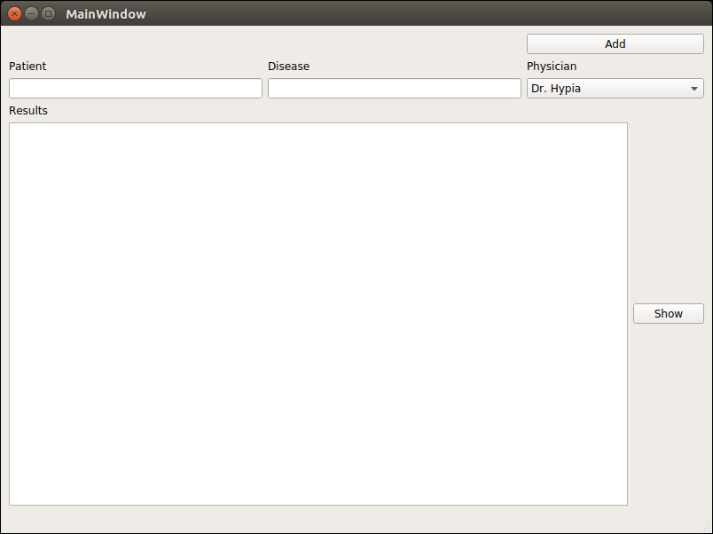

# Data Gathering: UI Design with Qt5

This a simple example for run design a UI with Qt5 in the purpose of data gathering. For more information please visit [Exalab Qt5 Tutorial](http://exalab.ir/2018/04/26/data-gathering-ui-design-with-qt/)
## Required Installations

Python 3+

***

PyQt5:
```sh
$ pip install PyQt5
```
***
pyuic5:
```sh
$ pip install pyqt5-dev-tools
```
## Usage

In the terminal, just enter below command:

```sh
$ python main.py
```

## Output
After run, output should be like this:

